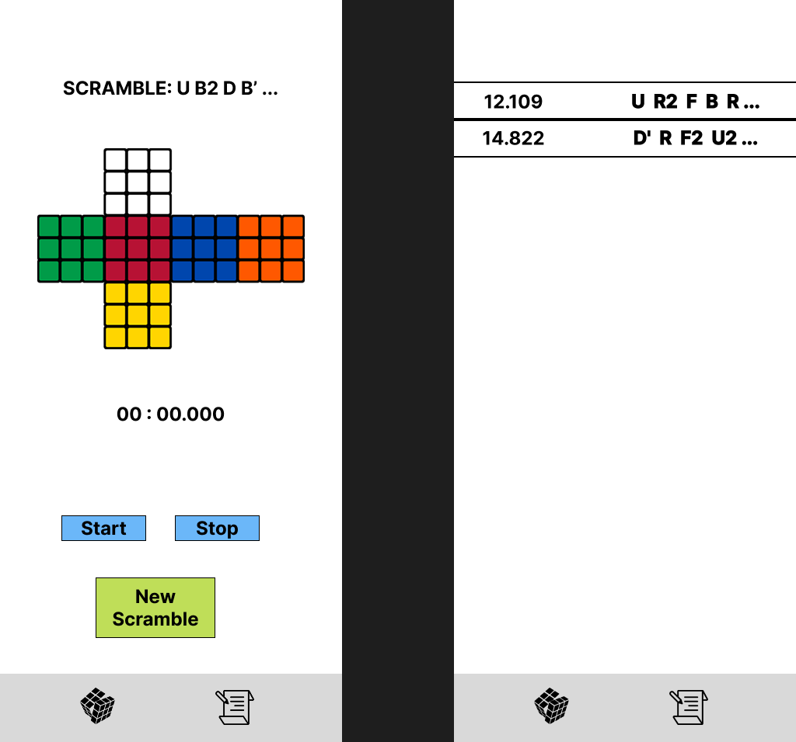

# ⏳ Time2Cube ⏳

## Table of Contents

1. [Overview](#Overview)
2. [Product Spec](#Product-Spec)
3. [Wireframes](#Wireframes)
4. [Schema](#Schema)

## Overview

### Description

Allows Rubik’s Cube solvers to scan their cube, receive real-time AR overlays for algorithms, and time their solves—all in one app. 
Beginners can learn visually with guided instructions, and advanced solvers can track their history and personal bests.

### App Evaluation

- **Category:** Education / Sports
- **Mobile:** Mobile is essential for AR scanning, real-time scrambling, and timing solves. The camera is used to recognize cube states,
  overlay solution steps, and provide visual feedback.
- **Story:** Helps solvers go from slow and frustrated to skilled and confident by giving them an all-in-one, visual-first tool. Makes learning
  algorithms less intimidating, improves practice through accurate timers and stats, and inspires speedcubers to beat their best times.
- **Market:** Appeals to beginner and intermediate cubers who want to improve, as well as serious speedcubers who track every solve.
  Rubik’s Cube has sold over 450M units globally, and the online cubing community is vibrant, active, and always seeking better tools.
- **Habit:** Users practice daily or weekly and rely on the app to generate scrambles, time sessions, and track performance.
- Solvers often aim for streaks, PBs (personal bests), or daily improvement goals—making this app a key part of their routine.
- **Scope:** V1 would include a scramble generator, manual timer, and solve history tracker. V2 would add AR cube state detection
  and visual overlays for guided learning. V3 would include session analytics and user profiles. V4 could expand to multiplayer scramble challenges or competitions.

## Product Spec

### 1. User Stories (Required and Optional)

**Required Must-have Stories**

* User can generate a new scramble sequence
* User can view a timer to start and stop their solve
* After stopping the timer, the solve is automatically saved to history
* Solve history includes scramble and solve time
* User can view a list of past solves
* User can delete a solve from the history
* User can navigate between two tabs: Timer and History
* User can see a visual layout of the Rubik's Cube (all 6 sides) after the scramble is generated

**Optional Nice-to-have Stories**

* User can delete a solve from the history
* Add statistics like average of last 5/12/100 solves
* Allow inspection time before solve starts
* Save history to local storage
* Option to share best solve
* Dark mode toggle
* Confirm before deleting a solve

### 2. Screen Archetypes

- [ ] ⏳ Timer Screen
* User can generate a new scramble sequence
* User can view a timer to start and stop their solve
* After stopping the timer, the solve is automatically saved to history
* User can see a visual layout of the Rubik’s Cube (all 6 sides) based on the current scramble

- [ ] 📝 History Screen
* User can view a list of past solves
* Each solve includes the scramble and the solve time

### 3. Navigation

**Tab Navigation** (Tab to Screen)

* Timer Tab &rarr; Timer Screen
* History Tab &rarr; History Screen

**Flow Navigation** (Screen to Screen)

- [ ] Timer Screen
* When the timer is stopped, the app automatically stores the solve and updates the history list (no manual save/confirmation required)
- [ ] History Screen
* Tapping on a past solve (optional) may expand the row to show full scramble or future stats
* (Optional) Swipe to delete a solve if added in future updates

## Wireframes

## Schema 

### Model: Solve
| Property       | Type           | Description                                                                  |
| -------------- | -------------- | ---------------------------------------------------------------------------- |
| `id`           | String         | Unique identifier for the solve (UUID or timestamp-based)                    |
| `scramble`     | String         | Scramble string shown to the user (e.g., `"U R2 F B R B2 R U2 ..."`)         |
| `scrambleList` | Array\[String] | Array of individual moves used to generate the scramble                      |
| `time`         | Float          | Solve time in seconds (e.g., `14.82`)                                        |
| `date`         | DateTime       | Timestamp of when the solve was completed                                    |
